# Pemrograman Mobile Pertemuan Minggu 3

| Nama  :   | Haidar Aly |
| :--------: | :-------: |

| Kelas :  | TI-3F    |
| :--------: | :-------: |

| Absen : |  09  |
| :--------: | :-------: |

| NIM   :  | 2241720258   |
| :--------: | :-------: |

## Praktikum 1
- Membuat Flutter Project
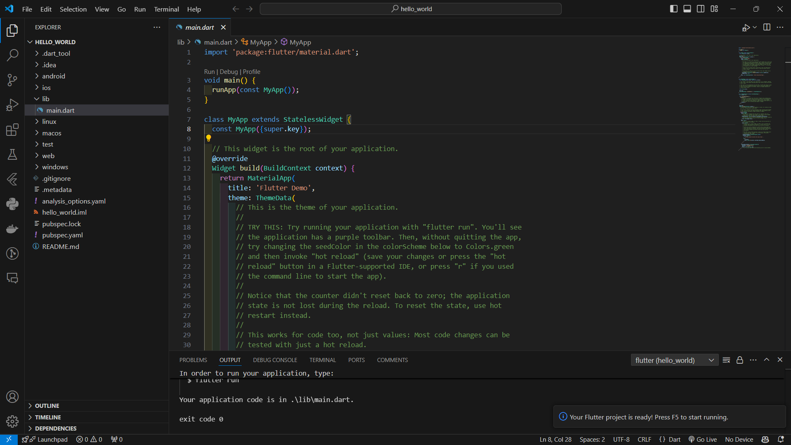

## Praktikum 2
- Menyalakan USB Debugging
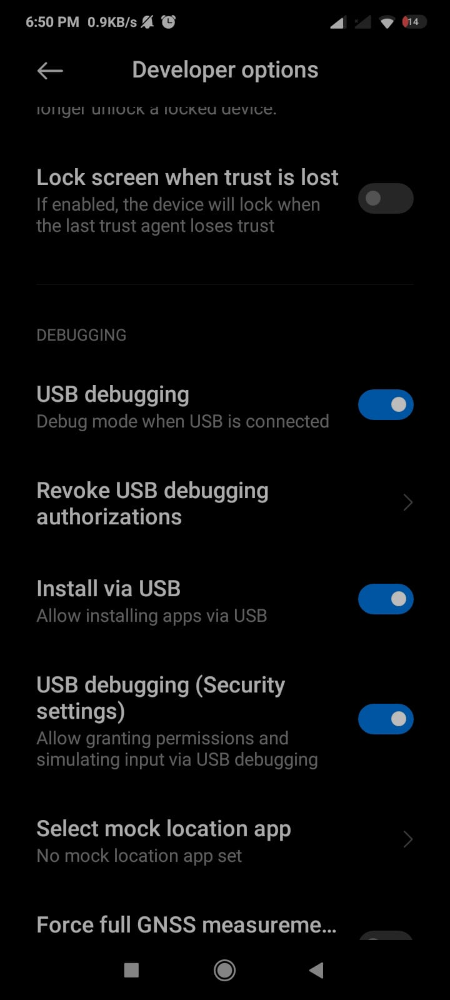

- Install USB Debug di Android Studio
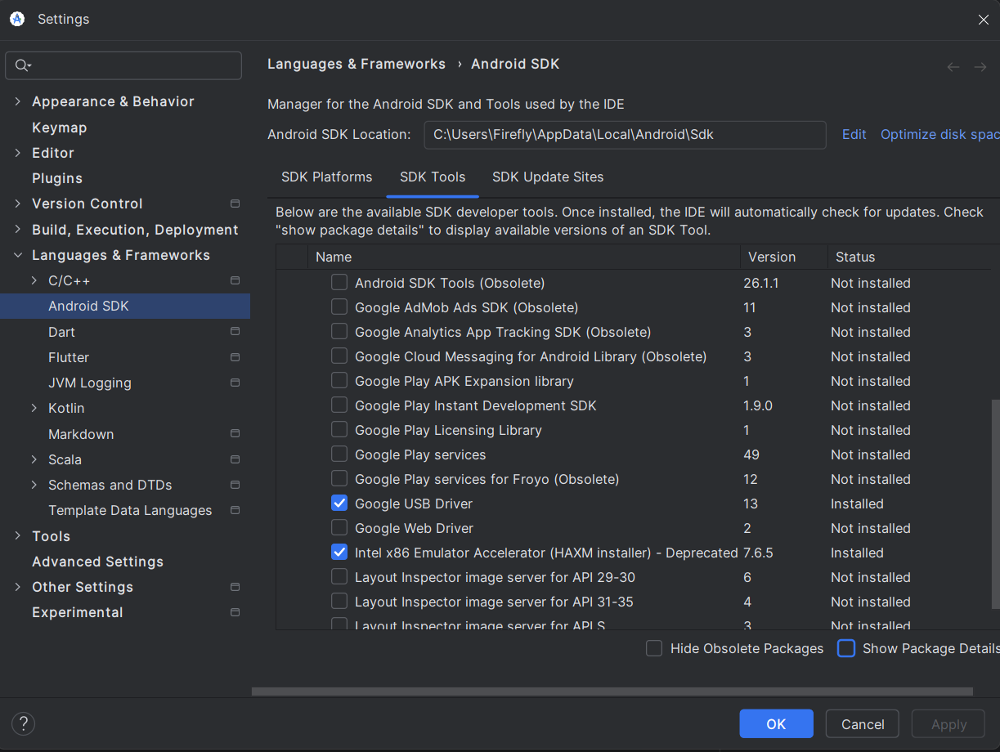

- Test run debug di Android
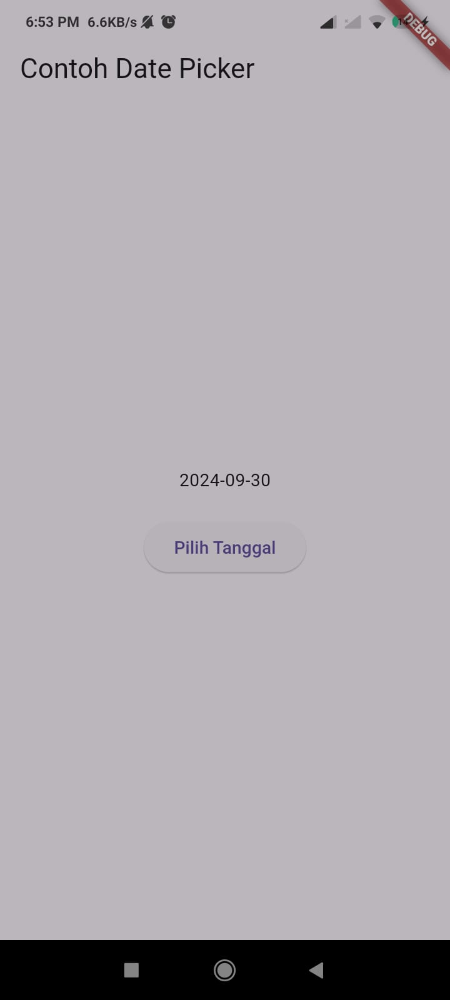

## Praktikum 3
- Membuat repo baru
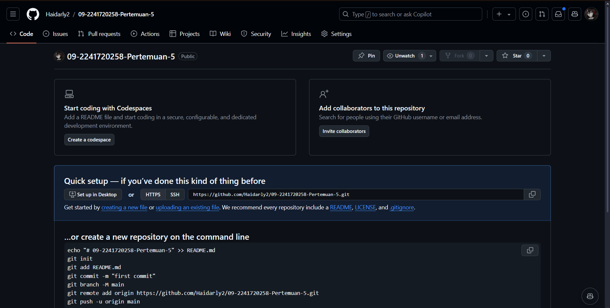

- First Commit
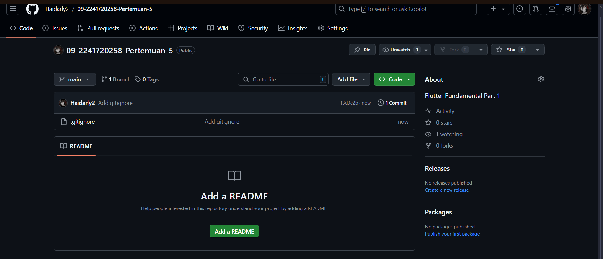

- Stage semua hello_world
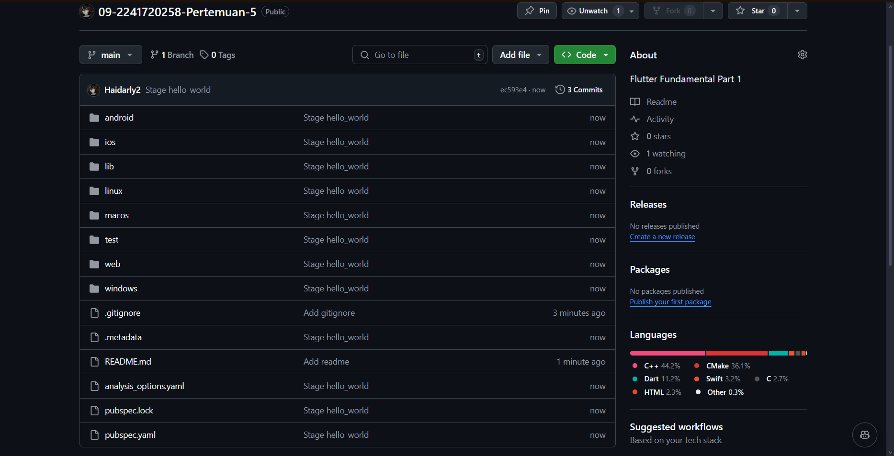

- Test debug di chrome
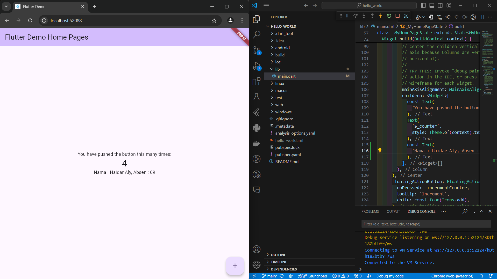

## Praktikum 4
- Text widget
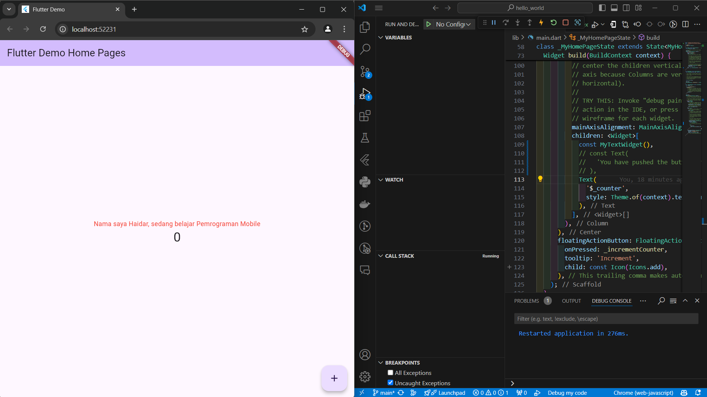

- Image Widget
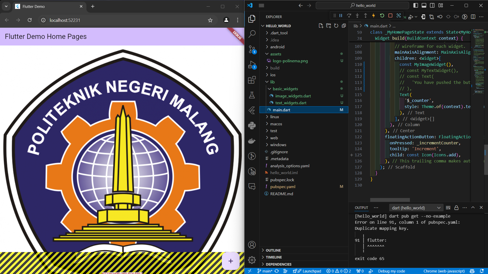

## Praktikum 5
- Cupertino button dan loading bar
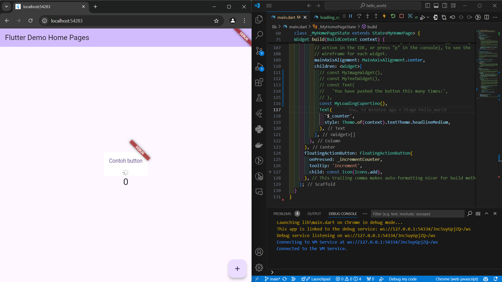

- Floating action button
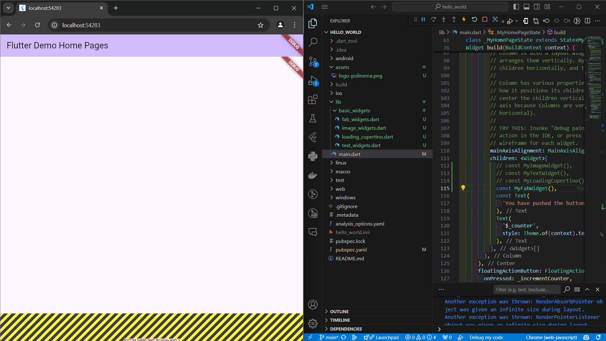

- Scaffold widget
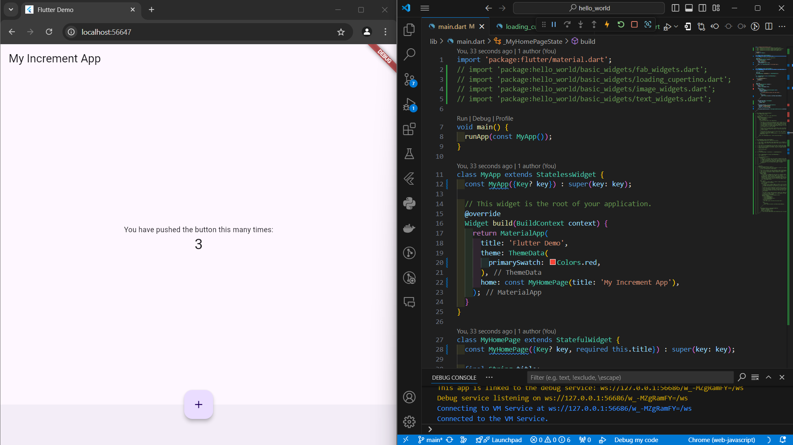

- Dialog widget
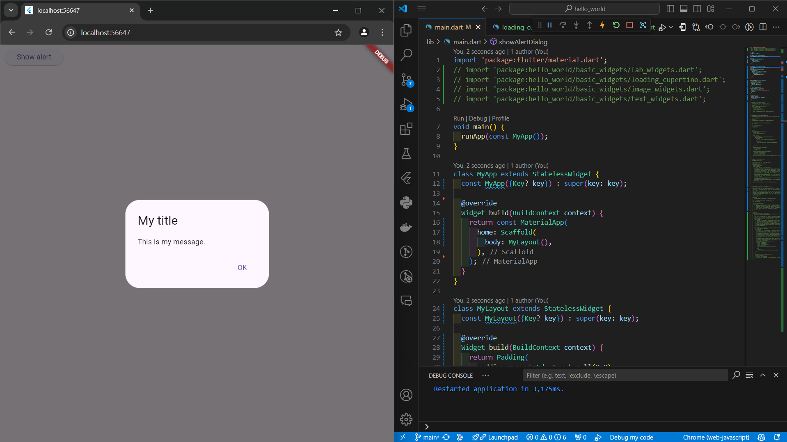

- Input dan selection widget
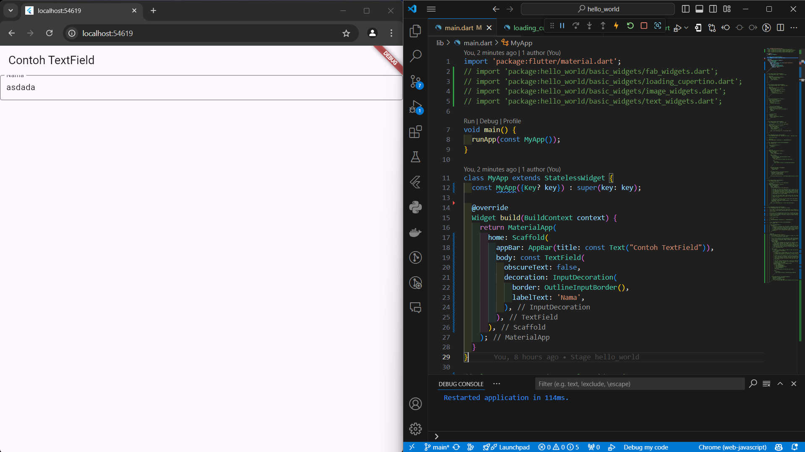

- Date picker
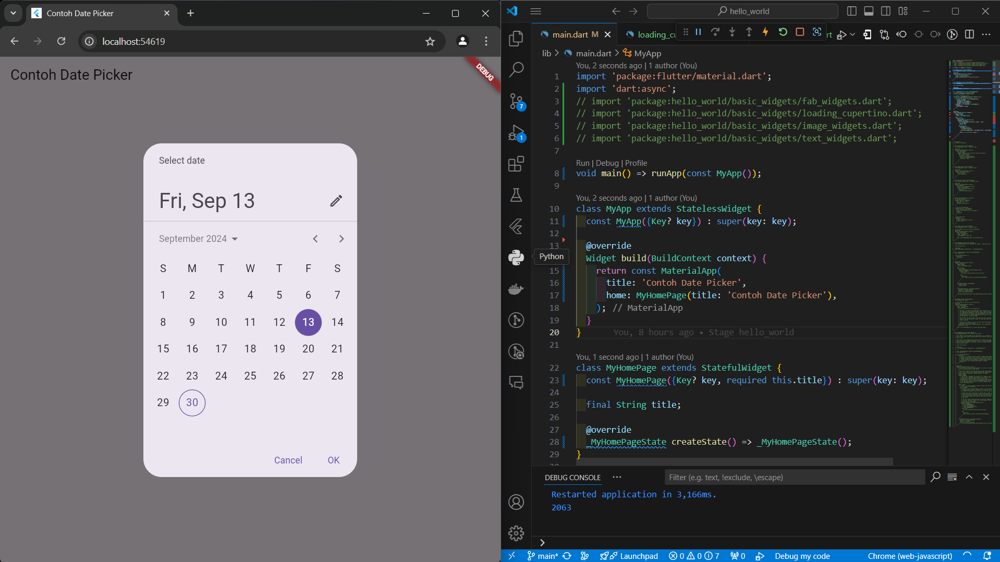