# Pemrograman Mobile Pertemuan Minggu 3

| Nama  :   | Haidar Aly |
| :--------: | :-------: |

| Kelas :  | TI-3F    |
| :--------: | :-------: |

| Absen : |  09  |
| :--------: | :-------: |

| NIM   :  | 2241720258   |
| :--------: | :-------: |

## Praktikum 1
- Membuat Flutter Project

## Praktikum 2
- Menyalakan USB Debugging

- Install USB Debug di Android Studio

- Test run debug di Android

## Praktikum 3
- Membuat repo baru

- First Commit

- Stage semua hello_world

- Test debug di chrome

## Praktikum 4
- Text widget

- Image Widget

## Praktikum 5
- Cupertino button dan loading bar

- Floating action button

- Scaffold widget

- Dialog widget

- Input dan selection widget

- Date picker

## Tugas
- Step 1
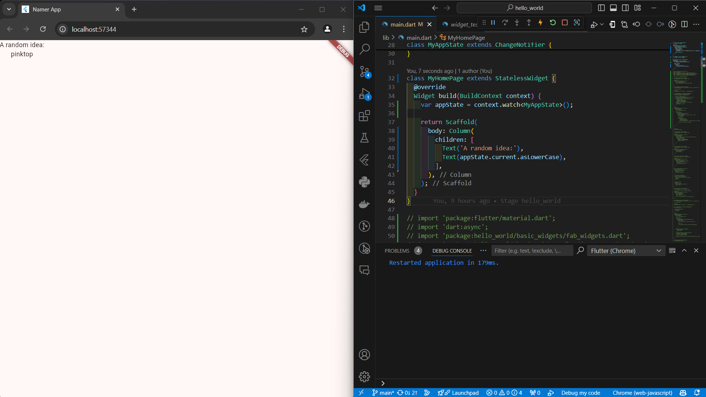
- Step 2
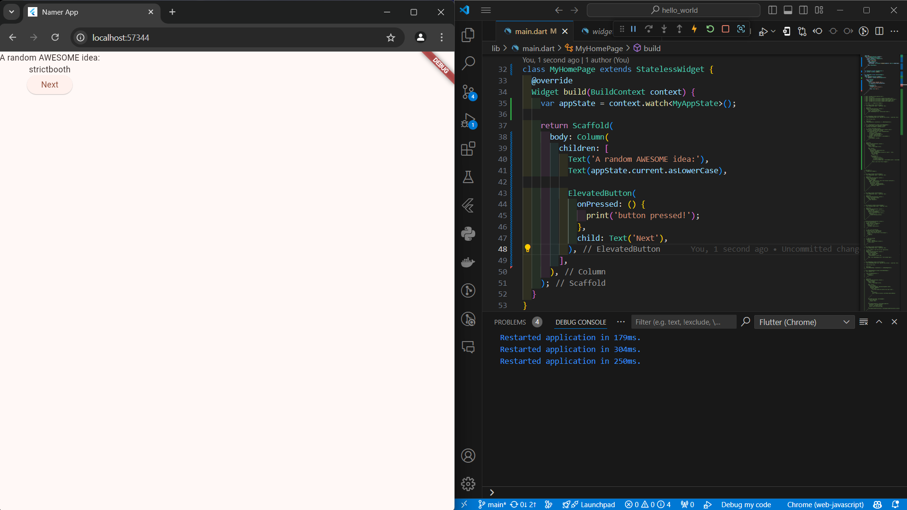
- Step 3
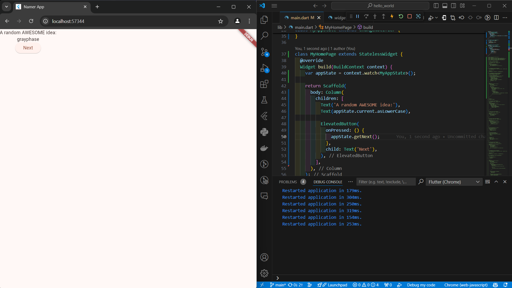
- Step 4
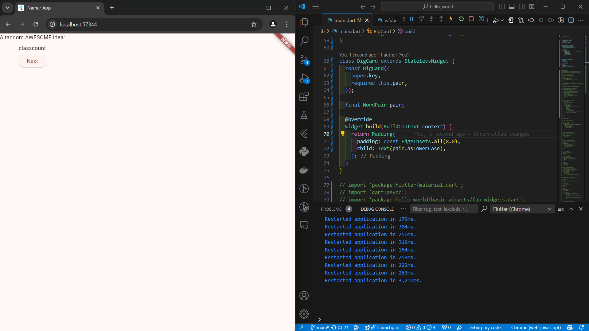
- Step 5

- Step 6
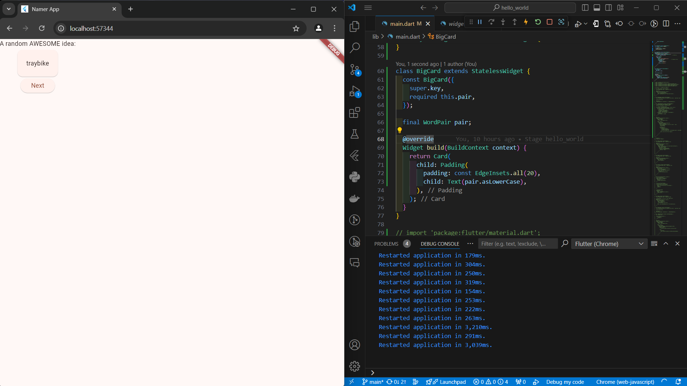
- Step 7
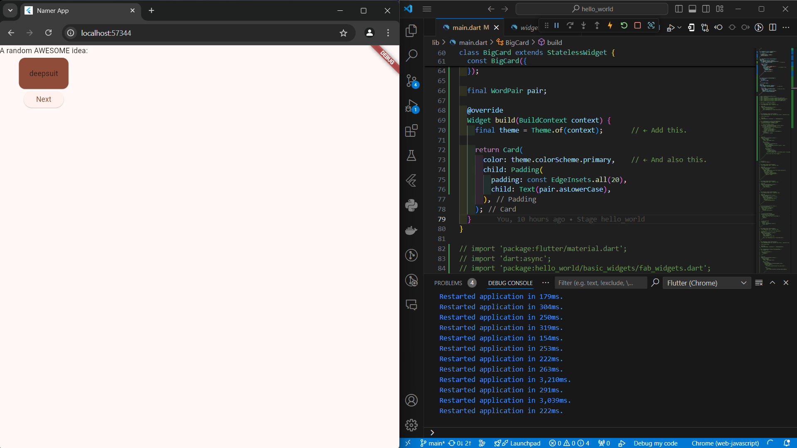
- Step 8
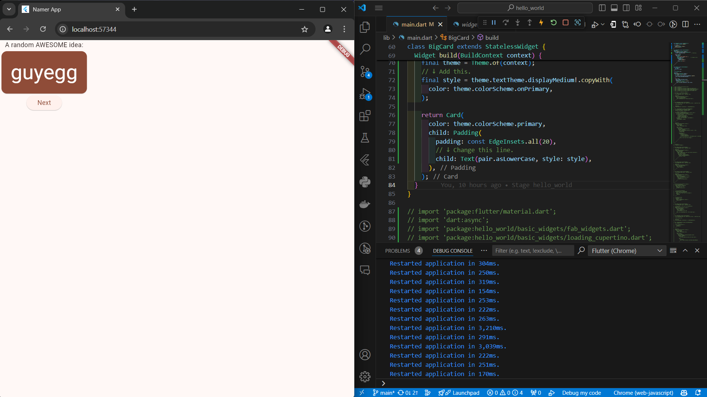
- Step 9
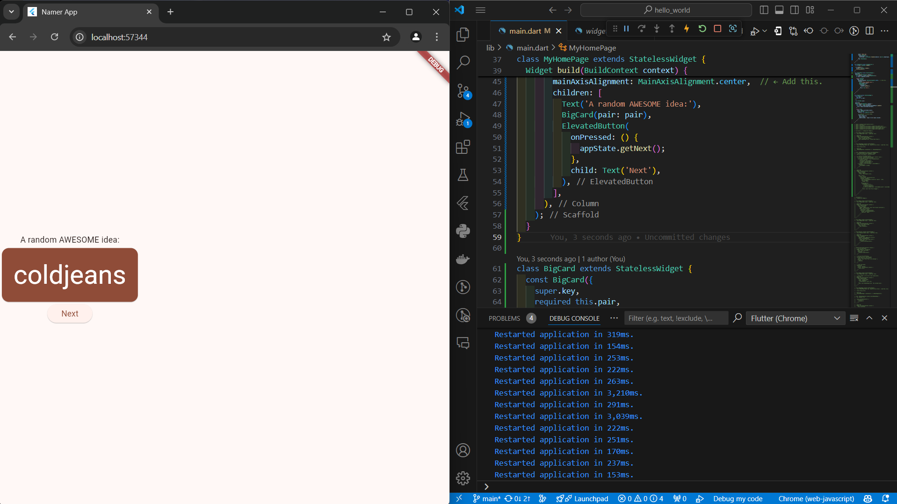
- Step 10
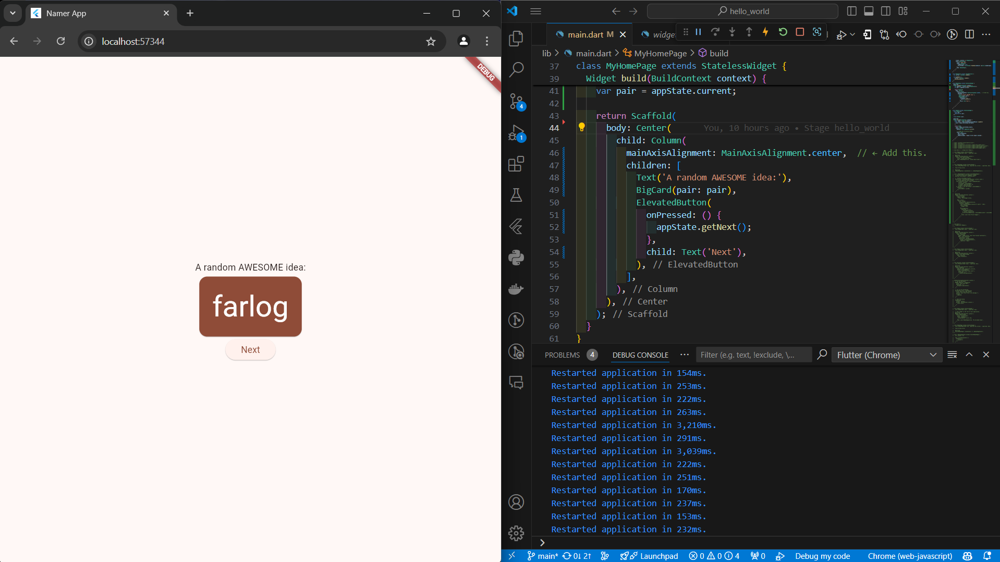
- Step 11
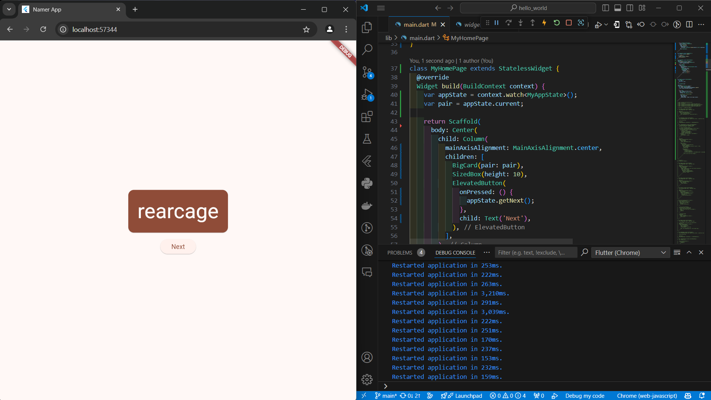
- Step 12
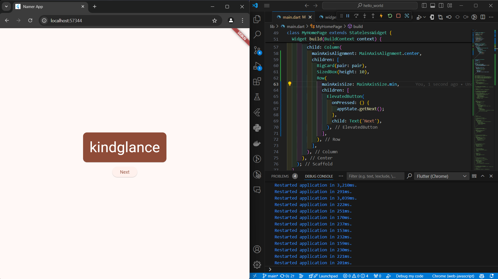
- Step 13
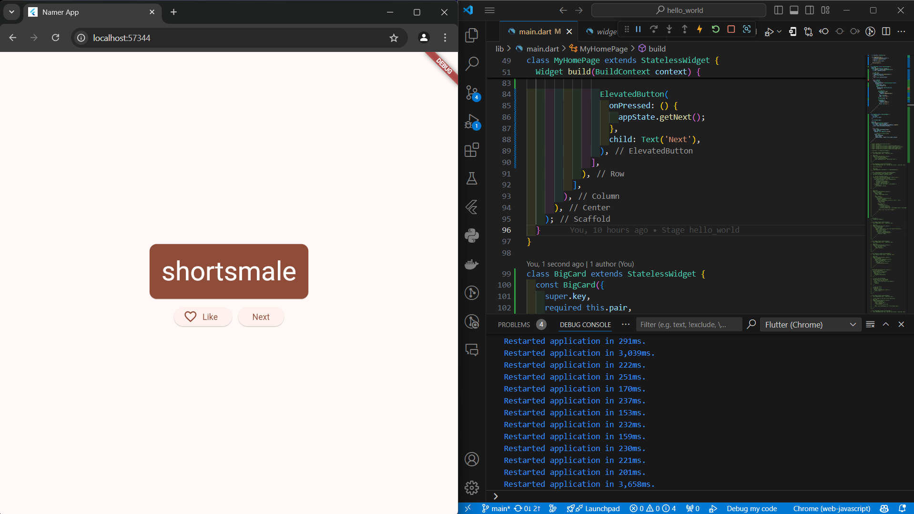
- Step 14
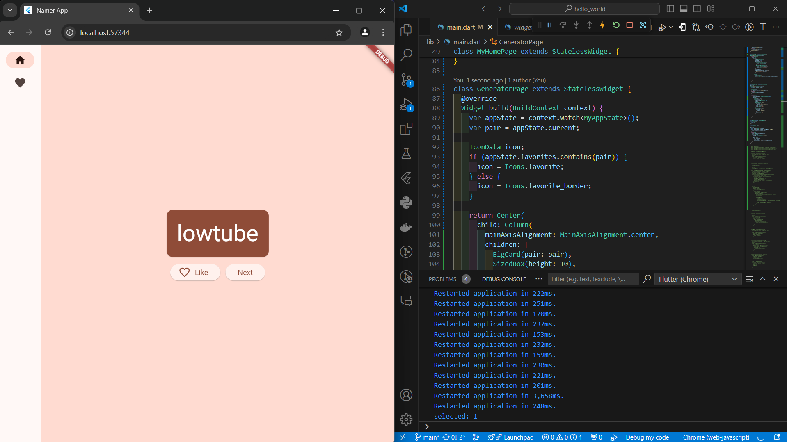
- Step 15
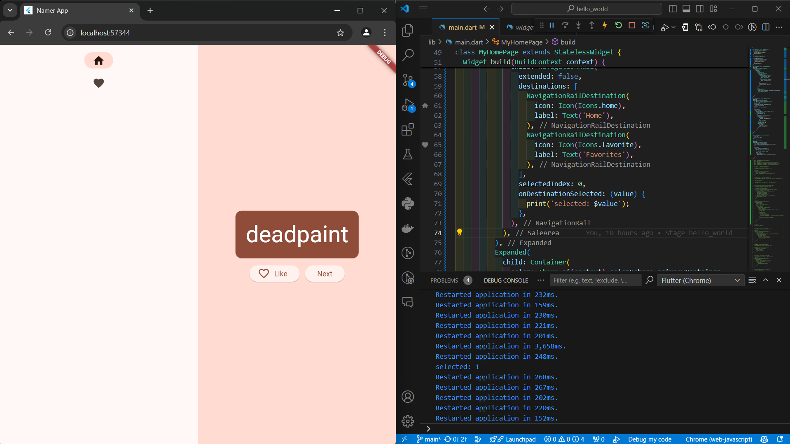
- Step 16
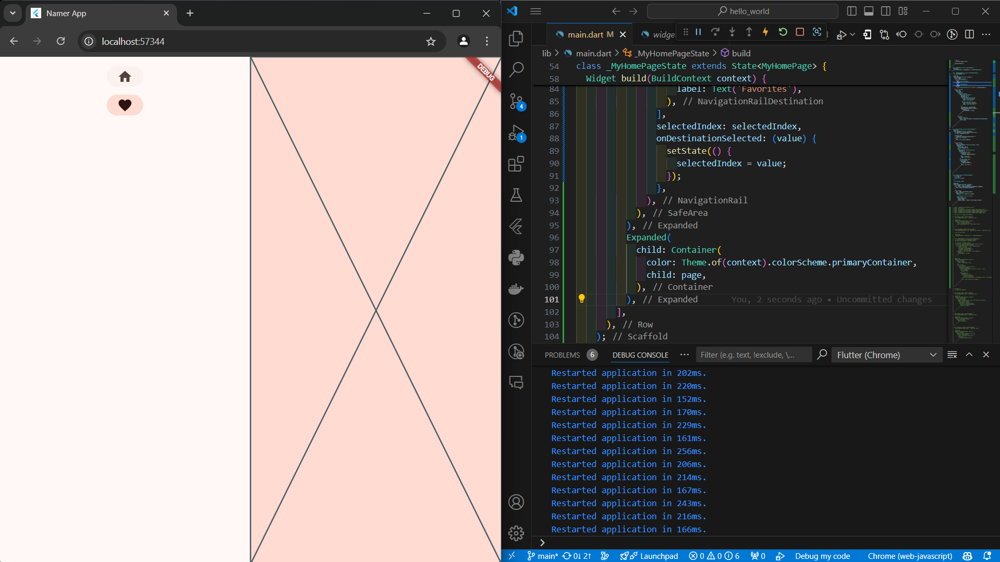
- Step 17
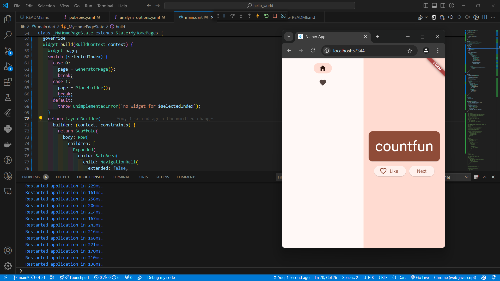
- Step 18
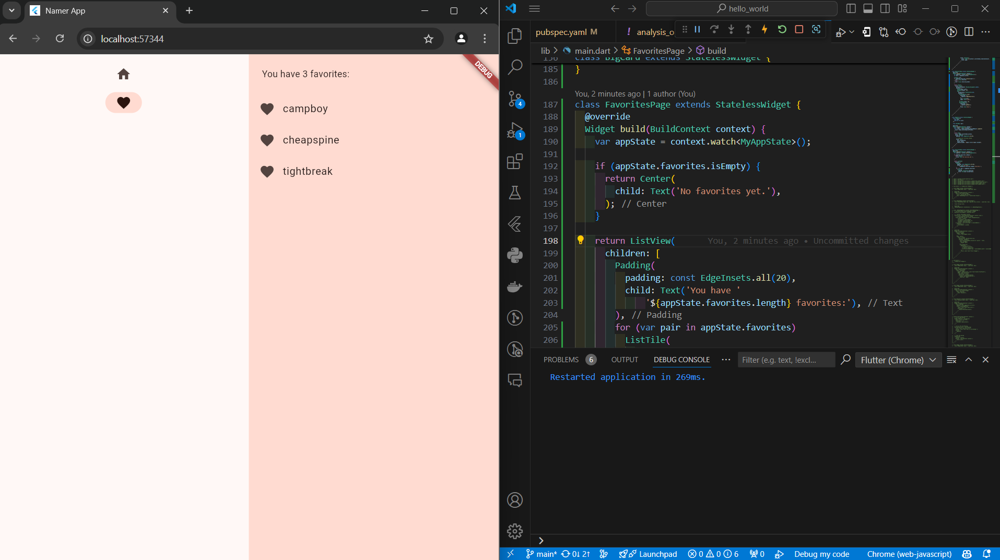